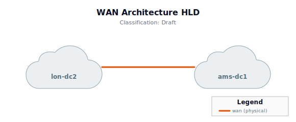
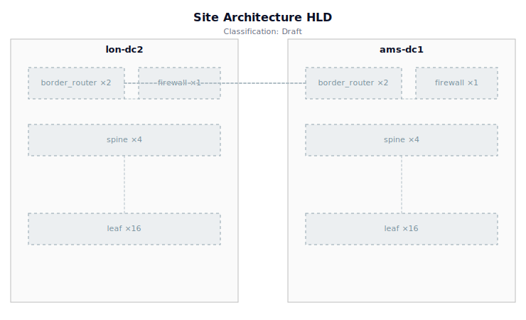
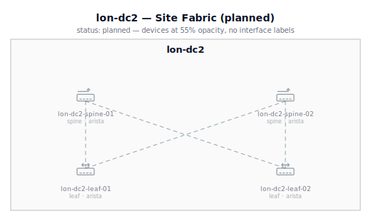
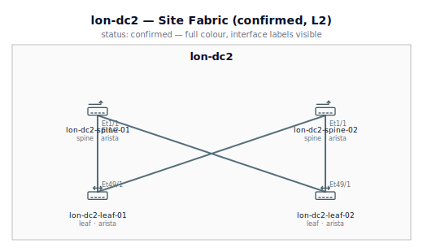
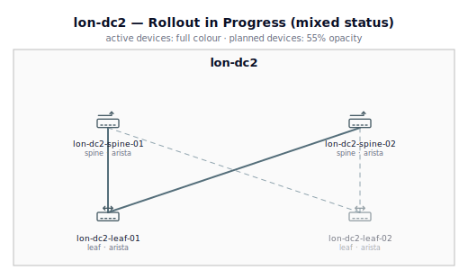
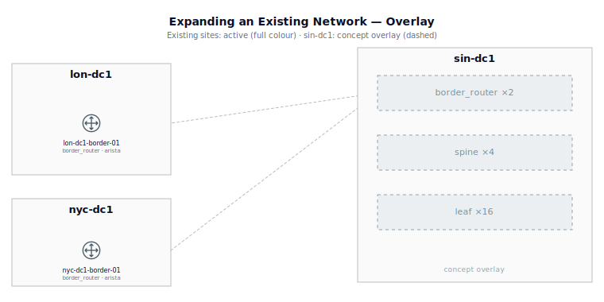

# NetDraw Design Workflow: From Concept to As-Built

This guide walks through using NetDraw across a full network design lifecycle — from
an architect's first sketch to implementation engineers deploying hardware. The same
YAML files and views evolve through the process; the diagrams update automatically
as detail is added and status fields are upgraded.

---

## The scenario

A network architect has been asked to design a new data centre pair: one in London,
one in Amsterdam. The design will be handed off to design engineers for LLD, then to
implementation engineers who will rack and cable the hardware.

---

## Stage 1 — Architect: Concept HLD

The architect starts with `hld.yml` — a shorthand format that describes topology as
roles and counts rather than named devices. No vendor, no model, no interface data
is needed at this stage.

### Files

**`hld.yml`**
```yaml
sites:
  - name: lon-dc2
    type: datacenter
    roles:
      border_router: 2
      firewall: 1
      spine: 4
      leaf: 16

  - name: ams-dc1
    type: datacenter
    roles:
      border_router: 2
      firewall: 1
      spine: 4
      leaf: 16

links:
  - from: lon-dc2/border_router
    to:   ams-dc1/border_router
    role: wan

  - from: lon-dc2/spine
    to:   lon-dc2/leaf
    role: fabric

  - from: ams-dc1/spine
    to:   ams-dc1/leaf
    role: fabric

  - from: lon-dc2/firewall
    to:   lon-dc2/border_router
    role: uplink

  - from: ams-dc1/firewall
    to:   ams-dc1/border_router
    role: uplink
```

**`views.yml`**
```yaml
views:
  - name: hld-wan
    detail_level: L0
    scope:
      collapse_sites: ["*"]
      exclude_links: [role=fabric]
    title:
      text: WAN Architecture HLD
      classification: Draft
    legend: true

  - name: hld-sites
    detail_level: L1
    scope:
      sites: [lon-dc2, ams-dc1]
    title:
      text: Site Architecture HLD
      classification: Draft
    legend: true
```

**`.netdraw.yml`**
```yaml
adapter: hld
sot: .
output: diagrams/
```

### Commands

```bash
netdraw validate           # confirms hld.yml is consistent
netdraw render --all       # produces diagrams/hld-wan.svg, diagrams/hld-sites.svg
```

### What the diagrams show

- **`hld-wan.svg`** (L0): Two cloud nodes — `lon-dc2` and `ams-dc1` — connected by a
  WAN link. Sites are collapsed to abstract nodes. Clean, one-page WAN overview.



- **`hld-sites.svg`** (L1): Each site expanded to show role groups. Dashed-border
  rectangles labelled `spine ×4`, `leaf ×16`, `firewall ×1`, `border_router ×2`.
  All elements in concept-mode visual treatment: light grey fill, dashed borders,
  dotted links. Visually signals "sketch, not committed design."



The architect iterates on this in minutes — change leaf count, add an OOB tier,
add a third site. Each file save re-renders in under a second with `netdraw watch`.

### Artefacts handed to design engineers

```
hld.yml          — the topology blueprint
views.yml        — scope and detail level definitions (unchanged throughout)
diagrams/        — concept SVGs for stakeholder review
```

---

## Stage 2 — Design Engineers: Named Devices (Planned → Confirmed)

Design engineers take the architect's `hld.yml` and run `netdraw expand` to scaffold
the flat YAML files. Then they fill in vendor, model, and interface assignments.

```bash
netdraw expand          # generates sites.yml, devices.yml, physical_links.yml
```

The adapter changes from `hld` to `flat`. The **`views.yml` is unchanged** — the
same scope definitions and detail levels work across all adapters.

### Files created

**`devices.yml`** (excerpt)
```yaml
devices:
  - name: lon-dc2-spine-01
    role: spine
    vendor: arista           # vendor decided, hardware not yet ordered
    site: lon-dc2
    status: planned          # model left empty — allowed at planned status

  - name: lon-dc2-spine-02
    role: spine
    vendor: arista
    site: lon-dc2
    status: planned

  - name: lon-dc2-leaf-01
    role: leaf
    vendor: arista
    site: lon-dc2
    status: planned

  # ... lon-dc2-leaf-02 through lon-dc2-leaf-16, border routers, firewall
  # ... ams-dc1 devices follow the same pattern
```

**`physical_links.yml`** (excerpt)
```yaml
physical_links:
  - a_end: lon-dc2-spine-01
    z_end: lon-dc2-leaf-01
    kind: physical
    role: fabric
    status: planned          # interfaces not yet assigned

  - a_end: lon-dc2-border-01
    z_end: ams-dc1-border-01
    kind: physical
    role: wan
    status: planned
```

**`.netdraw.yml`** (updated)
```yaml
adapter: flat
sot: .
output: diagrams/
```

### What the diagrams show

- Named devices appear with icons, but at **55% opacity** (planned visual treatment).
- At L1, role labels appear on links.
- At L2, no interface endpoint labels yet — `a_interface` and `z_interface` are empty.

### Upgrading to `confirmed` as design is finalised

Once interfaces and speeds are specified, links are upgraded to `confirmed`. The
validator enforces that `a_interface`, `z_interface`, and `speed` are all present.

```yaml
  - a_end: lon-dc2-spine-01
    z_end: lon-dc2-leaf-01
    a_interface: Ethernet1/1
    z_interface: Ethernet49/1
    speed: 100G
    kind: physical
    role: fabric
    status: confirmed        # design signed off, hardware not yet installed
```

At `confirmed` status, diagrams render at **full colour and opacity**. Interface
endpoint labels appear on L2 views. The visual treatment is indistinguishable from
active devices — this is intentional: `confirmed` means "this is the real design."

**`planned` (before interface assignment):**


**`confirmed` (design signed off):**


### Artefacts handed to implementation engineers

```
devices.yml          — named devices with vendor, status: confirmed
physical_links.yml   — cabling plan with interfaces, status: confirmed
logical_links.yml    — BGP/OSPF overlays if applicable
views.yml            — unchanged
diagrams/            — confirmed-status SVGs for implementation reference
```

---

## Stage 3 — Implementation Engineers: As-Built (Active)

As hardware is racked and cabling is verified, engineers upgrade status to `active`.
The validator in strict mode enforces that all required fields are present — model
number, source, and (for links) LLDP confirmation.

**`devices.yml`** (excerpt, during rollout)
```yaml
  - name: lon-dc2-spine-01
    role: spine
    vendor: arista
    model: 7050CX3-32S       # now required — status: active enforces this
    site: lon-dc2
    status: active           # racked, cabled, in production

  - name: lon-dc2-spine-02
    role: spine
    vendor: arista
    model: 7050CX3-32S
    site: lon-dc2
    status: planned          # ordered, not yet arrived
```

**`physical_links.yml`** (excerpt)
```yaml
  - a_end: lon-dc2-spine-01
    z_end: lon-dc2-leaf-01
    a_interface: Ethernet1/1
    z_interface: Ethernet49/1
    speed: 100G
    kind: physical
    role: fabric
    source: lldp_discovery   # now required — status: active enforces this
    status: active
```

### What the diagrams show during rollout

A **mixed-status site** renders truthfully: `active` devices appear at full colour,
`planned` devices appear muted. The diagram is an accurate picture of what is
deployed versus what is still incoming. This makes it useful for rollout tracking
and sign-off — not just documentation after the fact.



```bash
netdraw validate --mode strict   # fails loudly if active devices are missing fields
netdraw render --all              # as-built diagrams committed to git
```

---

## Expanding an existing network

The workflow above covers a greenfield design. The more common case is an architect
expanding a network that already exists — a new data centre, a new regional hub, a
new office connecting to existing infrastructure.

The `hld.yml` shorthand works here too, but it runs as an **overlay** on the existing
SoT rather than replacing it. Drop an `hld.yml` file into any SoT directory and
NetDraw will merge the concept-mode additions on top of whatever the base adapter
returns. No changes to `.netdraw.yml` are needed.

**Example:** Your firm already has two data centres in flat YAML. You want to sketch a
third.

**`hld.yml`** (new file, placed alongside existing `devices.yml`)
```yaml
sites:
  - name: sin-dc1
    type: datacenter
    roles:
      border_router: 2
      spine: 4
      leaf: 16
      firewall: 1

links:
  # Internal links — site/role references (concept devices)
  - from: sin-dc1/spine
    to:   sin-dc1/leaf
    role: fabric

  # Connect to existing network — bare device names (existing devices)
  - from: sin-dc1/border_router
    to:   lon-dc1-border-01
    role: wan
  - from: sin-dc1/border_router
    to:   nyc-dc1-border-01
    role: wan
```

The distinction is in the link syntax:
- `sin-dc1/spine` — contains `/`, so it's a `site/role` reference resolving to a
  concept synthetic device
- `lon-dc1-border-01` — contains no `/`, so it's a bare device name resolving to an
  existing device from the base adapter

**What the diagrams show:** The existing LON-DC1 and NYC-DC1 render at full colour
(their status is `active`). SIN-DC1's role groups render in concept mode — dashed
borders, `spine ×4`, `leaf ×16`. The WAN links connecting them use concept-mode
styling. The same views that already show the existing sites will now include SIN-DC1
automatically if their scope matches (e.g. `sites: [lon-dc1, nyc-dc1, sin-dc1]`).



The validator treats cross-references as real — if `lon-dc1-border-01` isn't in the
base adapter's device list, validation fails with a clear error rather than silently
producing a broken diagram.

When design engineers take over, they run `netdraw expand` to scaffold `devices.yml`
and `physical_links.yml` from `hld.yml`, then delete `hld.yml`.

---

## Connecting to an existing SoT (coming post-v1)

If your organisation already uses Nautobot or NetBox, you will not need to maintain
flat YAML files at all. Adapters for both are planned post-v1:

| Adapter | How it works |
|---|---|
| `flat` | Hand-maintained YAML files. Good for new designs or small networks. |
| `hld` | Role-counts shorthand. Architect/concept stage only, standalone greenfield. |
| `perdevice` | One YAML file per device, links derived from device config. For custom IaC pipelines. |
| `nautobot` | GraphQL query against a live Nautobot instance. _(planned)_ |
| `netbox` | REST API against a live NetBox instance. _(planned)_ |

The `hld.yml` overlay works with all adapters — including future Nautobot and NetBox
adapters. An architect at a firm running Nautobot can drop an `hld.yml` into their
NetDraw project directory and sketch new infrastructure against the live Nautobot SoT
without touching Nautobot itself. `views.yml` remains the only file they maintain.

---

## The key invariant

**`views.yml` never changes across the lifecycle.** The architect defines views
(scope, detail level, title) at stage 1, and those definitions remain valid through
stages 2 and 3. The rendered diagrams evolve purely because the YAML data evolves —
adding names, adding interfaces, upgrading status fields.

This means diagrams committed to git at each stage are a faithful record of the
design's state at that moment. The full history is auditable.

---

